

  

    
Macworld 2007 as launch architecture

    <h1>How Jobs made the iPhone feel inevitable</h1>
    
A merged read of the transcript, keynote visuals, and rhetorical mechanics behind the launch.

    

      Transcript-led
      Visual evidence
      Rhetorical analysis
    

  

  

    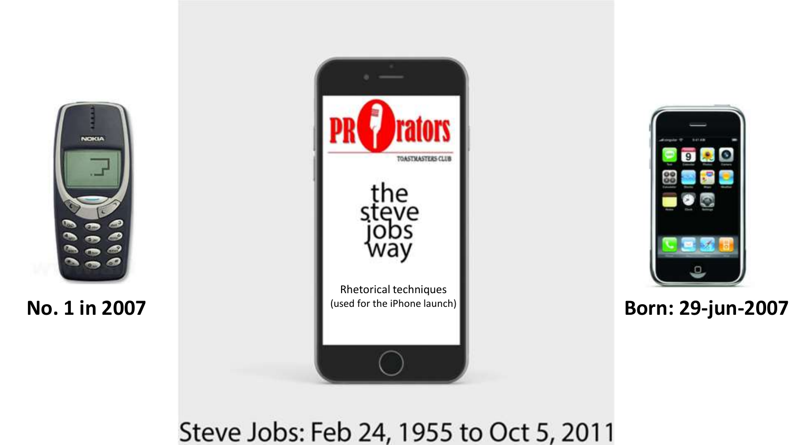
  

Sources: supplied transcript PDF and supplied companion slide PDF.

---

  

  <h1>The presentation is not a product tour. It is a sequence of belief changes.</h1>
  
Jobs moves the audience from category familiarity, to dissatisfaction, to a new interface logic, to proof through live use.

---

  

    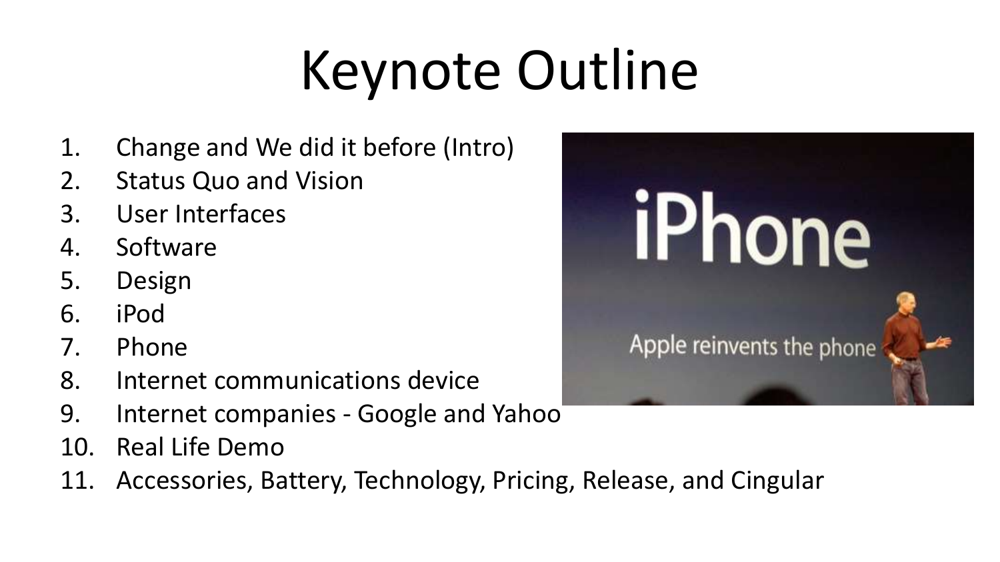
  

  

    
The spine

    <h2>He controls attention by changing the question every few minutes</h2>
    <ul class="compact">
      <li><strong>Why now?</strong> Apple has changed industries before.</li>
      <li><strong>Why this?</strong> Existing smartphones are compromised.</li>
      <li><strong>Why believe?</strong> The interface removes the compromise.</li>
      <li><strong>Why buy?</strong> Every demo lands on a familiar daily job.</li>
    </ul>
    

      <h3>What he is doing</h3>
      
The outline is a persuasion ladder: establish authority, create tension, reveal a mechanism, then let the demo cash the claim.

    

  

---

  

    
Move 1: historical permission

    <h2>Before the phone appears, he earns the right to announce a category shift</h2>
    
“A revolutionary product comes along that changes everything.”

    
Macintosh and iPod are not nostalgia. They are precedent: Apple has done this kind of discontinuity before.

    

      <h3>Why it works</h3>
      
The audience is asked to judge the iPhone inside a lineage of successful breaks, not inside the current phone aisle.

    

  

  

    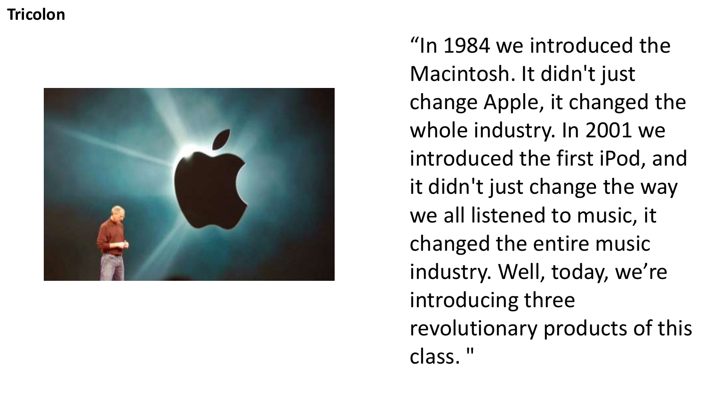
  

---

  

    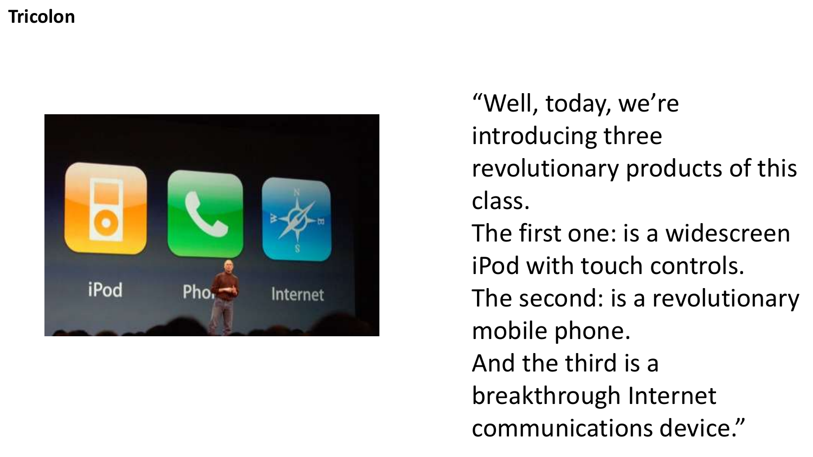
  

  

    
Move 2: the three-in-one reveal

    <h2>The first big surprise is linguistic before it is visual</h2>
    
“An iPod, a phone... are you getting it?”

    
He names three categories, repeats them, then collapses them. The audience participates in the reveal before seeing the device.

    

      <h3>Mechanics</h3>
      
Power of three plus repetition creates a pattern, then the punchline breaks the pattern. The laugh is also comprehension.

    

  

---

  

    
Move 3: frame the enemy

    <h2>He makes the status quo look trapped by its own hardware</h2>
    
“They all have these keyboards...”

    
The critique is not “competitors are ugly.” It is more structural: fixed buttons cannot adapt to software.

    

      <h3>Why it works</h3>
      
Once the problem is framed as adaptability, every keyboard phone looks obsolete even before iPhone features are listed.

    

  

  

    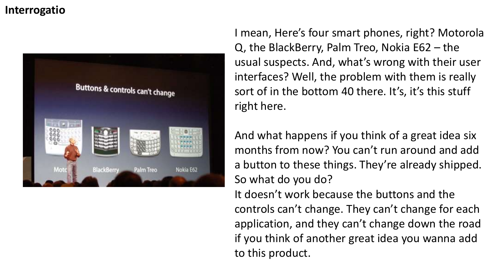
  

---

  

    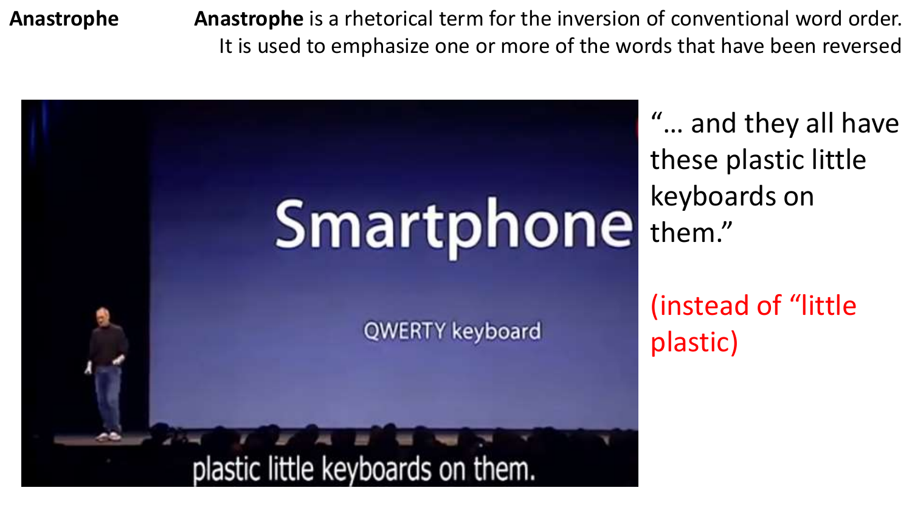
  

  

    
Positioning

    <h2>The product occupies a white space he has just drawn</h2>
    
Regular phones are not smart enough. Smartphones are not easy enough. iPhone is presented as a leap across both axes.

    

      <h3>What to copy</h3>
      
Do not start with features. Draw the market map so the desired product position becomes the obvious missing quadrant.

    

  

---

  

    
Move 4: solve from first principles

    <h2>The “giant screen” is introduced as a logical conclusion</h2>
    
“Get rid of all these buttons.”

    
He walks the room from computers to phones: bitmap screen, pointing device, adaptable interface.

    

      <h3>Why it works</h3>
      
The audience is not asked to accept a black-box invention. They are led through a familiar analogy until the new device feels derived.

    

  

  

    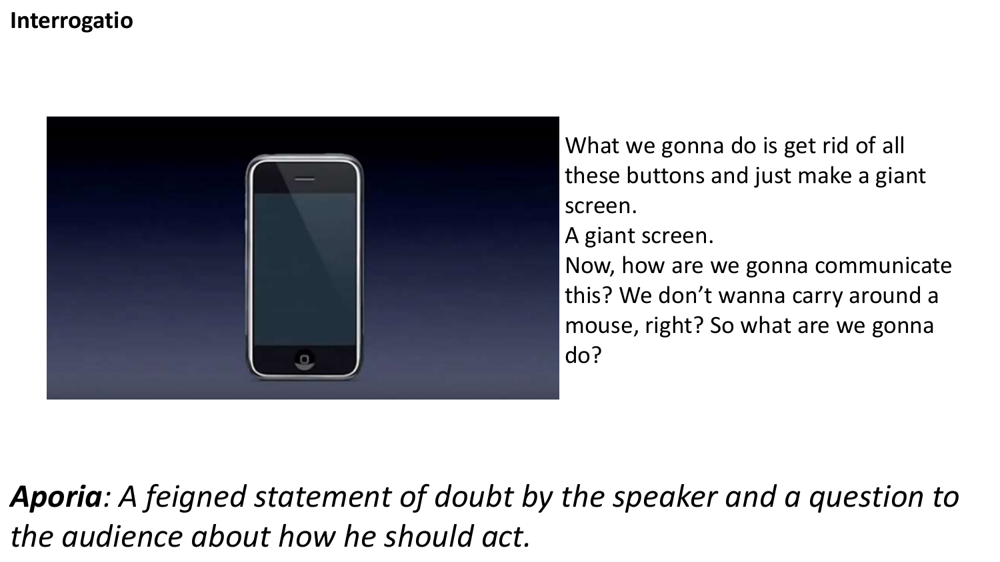
  

---

  

    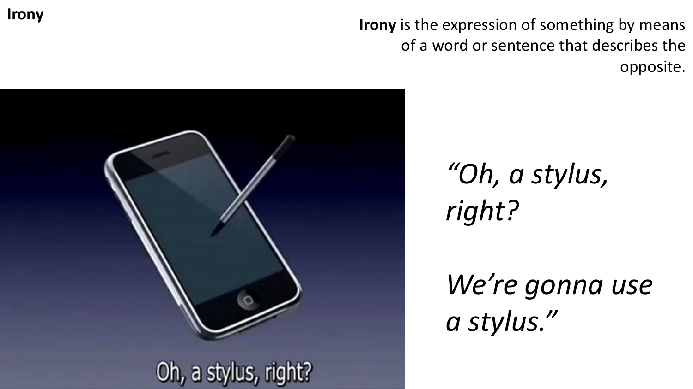
  

  

    
Contrast

    <h2>The stylus joke is a strategic rejection, not just a laugh line</h2>
    
“Who wants a stylus?”

    
The physical object becomes a symbol of old interaction debt: lose it, store it, manage it.

    

      <h3>Why it works</h3>
      
He removes an expected answer before revealing the better answer. That makes multi-touch feel cleaner by comparison.

    

  

---

  

    
Move 5: make the mechanism memorable

    <h2>“Born with ten of them” turns technical input into common sense</h2>
    
Multi-touch could have been described as sensor density and gesture recognition. Jobs makes it human: fingers first, technology second.

    

      <h3>What he is doing</h3>
      
He translates an engineering breakthrough into a bodily fact. That reduces perceived learning cost.

    

  

  

    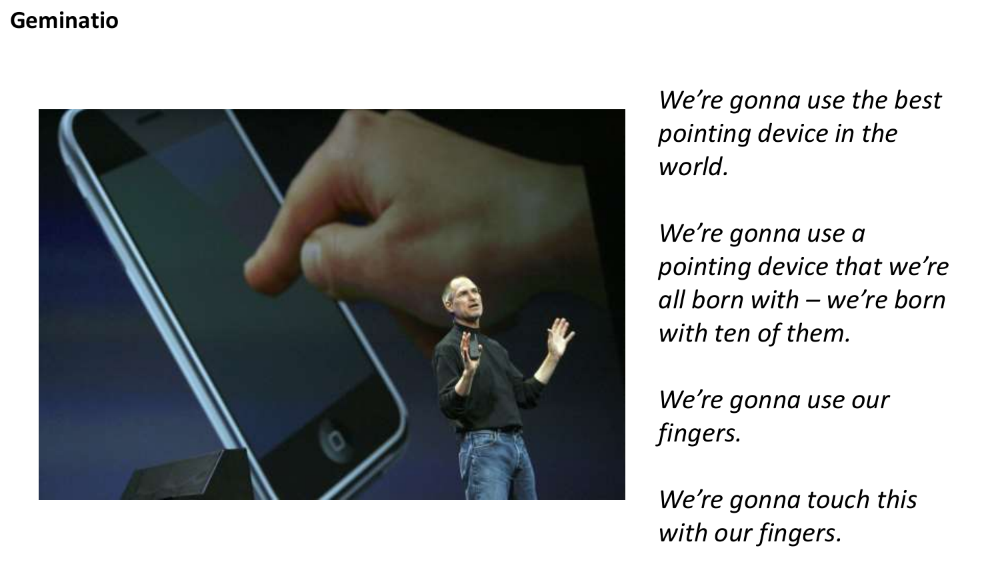
  

---

  

    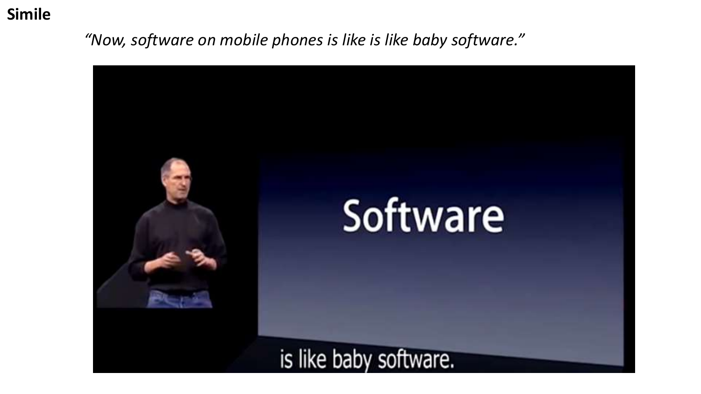
  

  

    
Substrate

    <h2>OS X is the credibility bridge from toy to computer</h2>
    
“Desktop-class applications.”

    
The software claim explains why the screen matters: the device is not merely touchable; it can run richer, adaptable applications.

    

      <h3>Why it works</h3>
      
This upgrades the category from phone feature set to computing platform, which justifies the later ecosystem claims.

    

  

---

  

    
Adoption bridge

    <h2>iTunes makes the new device feel operationally familiar</h2>
    
After the radical interface claim, he lowers switching anxiety: millions already know how to sync an iPod.

    

      <h3>Pattern</h3>
      
Alternate novelty with familiarity. Break the category, then show the user does not need to relearn everything.

    

  

  

    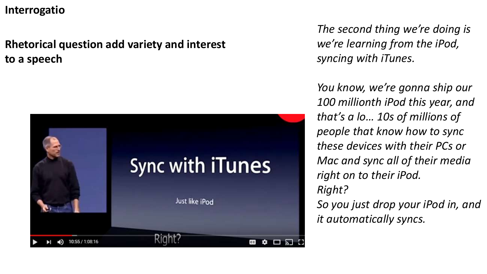
  

---

  

    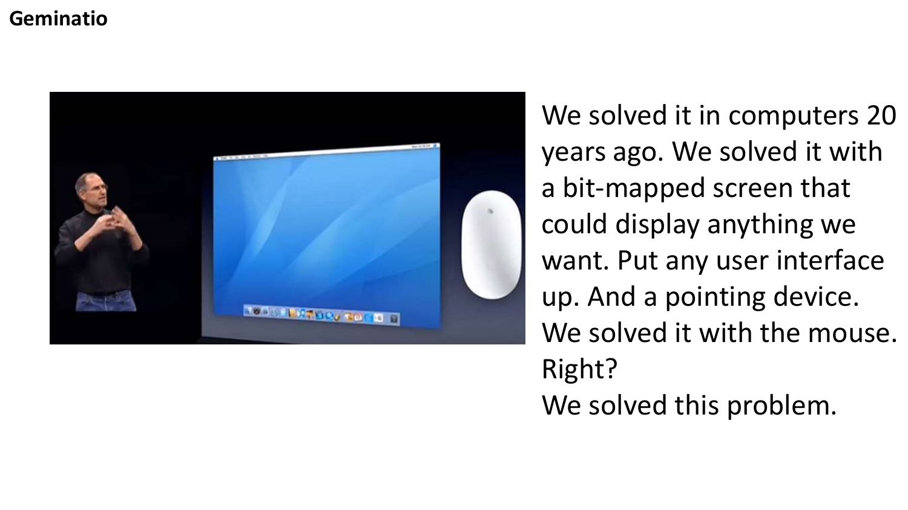
  

  

    
Object reveal

    <h2>Industrial design is delayed until the argument is ready for it</h2>
    
By the time the object is described, the audience knows why the front has one button and why thinness matters.

    

      <h3>Why it works</h3>
      
The device is not introduced as a beautiful artifact alone. Its form is the visible consequence of the interface thesis.

    

  

---

  

  <h1>The demo is built around verbs, not specs.</h1>
  
Touch, scroll, swipe, pinch, call, merge, browse, zoom. The product becomes understandable as a chain of actions.

---

  

    
Demo principle

    <h2>He starts with the smallest possible magic trick: unlock</h2>
    
“Want to see that again?”

    
The first demo is not a feature checklist. It is a physical proof that the interface is direct, safe, and repeatable.

    

      <h3>Why it works</h3>
      
Repetition turns a tiny gesture into a shared event. The audience learns the interaction grammar before the apps arrive.

    

  

  

    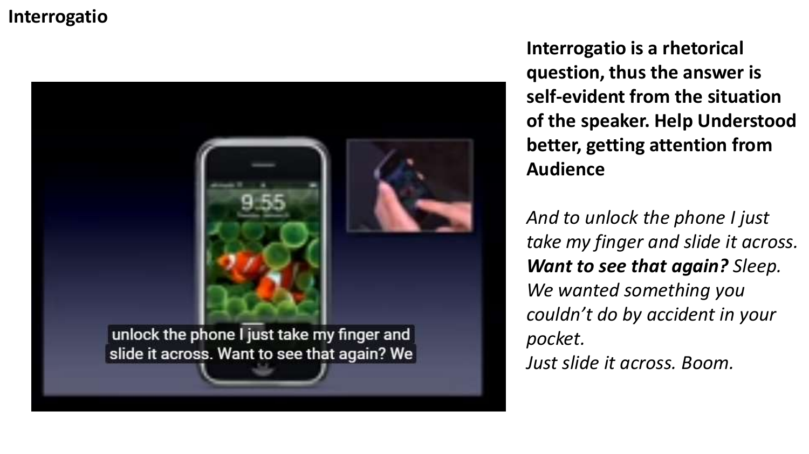
  

---

  

    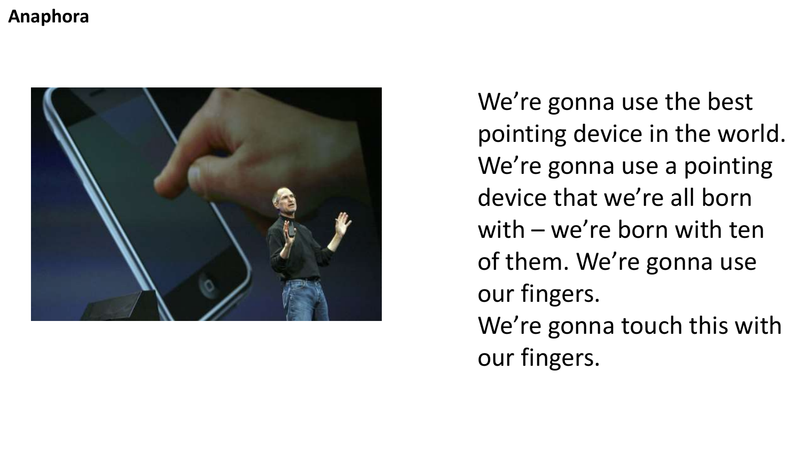
  

  

    
Demo principle

    <h2>The first iPod proof is not music. It is scrolling.</h2>
    
“I just take my finger, and I scroll.”

    
The action compresses the whole thesis: no stylus, no keyboard, no mode switch, no instruction manual.

    

      <h3>Why it matters</h3>
      
A mundane list becomes the strongest evidence that the phone has a new control language.

    

  

---

  

    
Emotional pacing

    <h2>He lets delight punctuate utility</h2>
    
Cover Flow and album art are not the market thesis. They create emotional surplus after the usability thesis is proven.

    

      <h3>Move</h3>
      
After demonstrating control, he shifts into pleasure: it looks gorgeous, moves fluidly, and feels like a high-end object.

    

  

  

    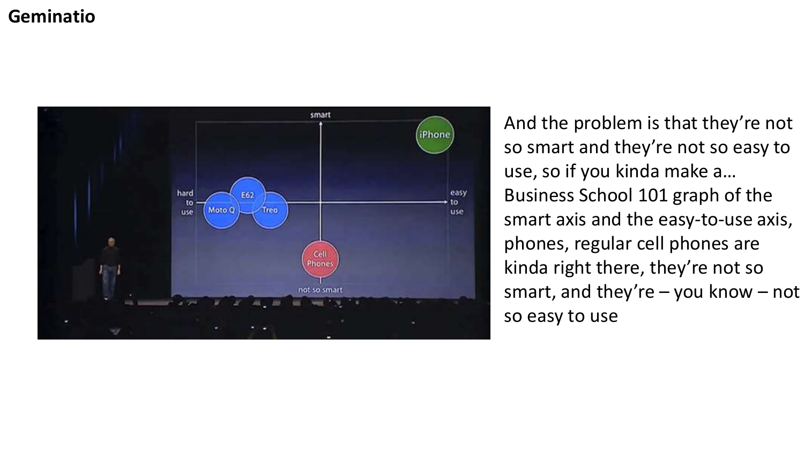
  

---

  

    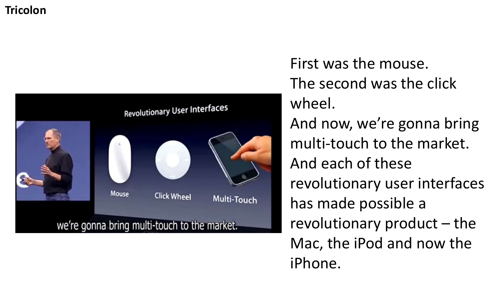
  

  

    
Interface lineage

    <h2>He names the control breakthrough as the platform breakthrough</h2>
    
Mouse made Mac possible. Click wheel made iPod possible. Multi-touch makes iPhone possible.

    

      <h3>What he is doing</h3>
      
This is a causal story, not a comparison table. The interface is framed as the unlock for a new product category.

    

  

---

  

    
Phone demo

    <h2>The first public call is staged as product proof and social proof</h2>
    
Calling Jony and Phil makes call management legible, but it also shows Apple’s own leaders using the device live.

    

      <h3>Why it works</h3>
      
The audience sees interruption, hold, merge, private call, and hangup as one continuous story rather than separate features.

    

  

  

    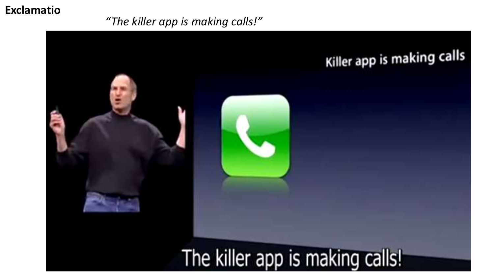
  

---

  

    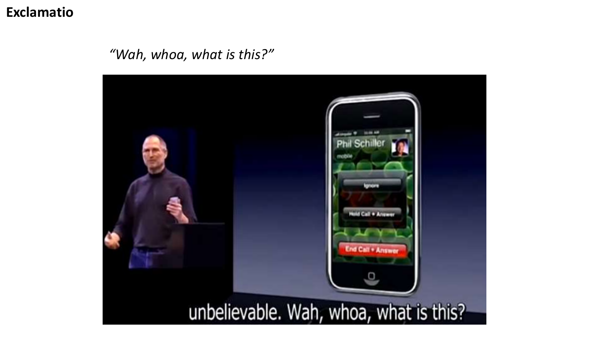
  

  

    
Rebuttal by demonstration

    <h2>The soft keyboard answers the obvious objection in context</h2>
    
Instead of arguing against plastic keyboards abstractly, he types a message while the audience watches correction and send flow.

    

      <h3>What he is doing</h3>
      
He does not hide the risky part of the product. He puts it in a normal task and lets successful completion carry the argument.

    

  

---

  

    
Touch vocabulary

    <h2>Pinch-to-zoom is taught as a moment, not a manual page</h2>
    
The photo demo creates a shared vocabulary for direct manipulation that later transfers to web pages and maps.

    

      <h3>Why it works</h3>
      
The gesture feels discoverable because it is shown on a familiar object: a photo someone wants to inspect.

    

  

  

    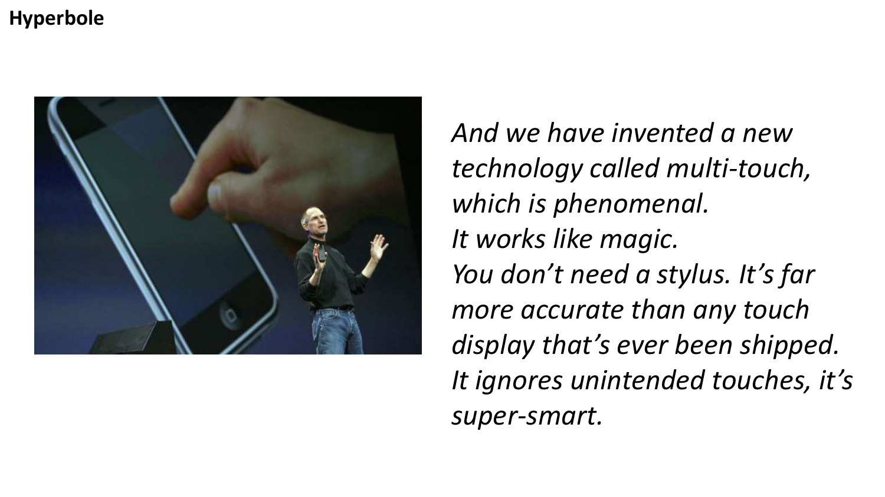
  

---

  

    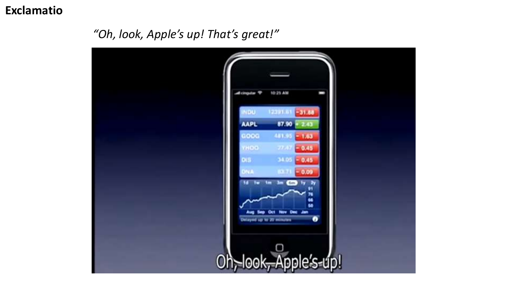
  

  

    
Category escalation

    <h2>Safari turns the phone into the Internet, not a mobile substitute</h2>
    
“Not a baby web browser.”

    
The New York Times demo is chosen because it is dense, familiar, and not obviously designed for a phone.

    

      <h3>Why it works</h3>
      
Showing the full page makes the claim falsifiable. The audience can immediately see whether “real web” is credible.

    

  

---

  

    
Partnerships as proof

    <h2>Google and Yahoo are introduced only after the product frame is established</h2>
    
The partners do not define the device. They validate the Internet layer once the device has already earned attention.

    

      <h3>Pattern</h3>
      
Use partner logos late enough that they amplify the product thesis instead of substituting for it.

    

  

  

    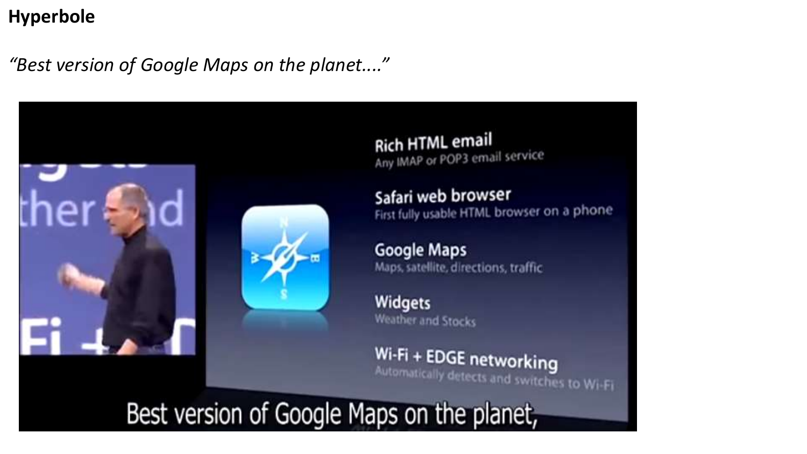
  

---

  

    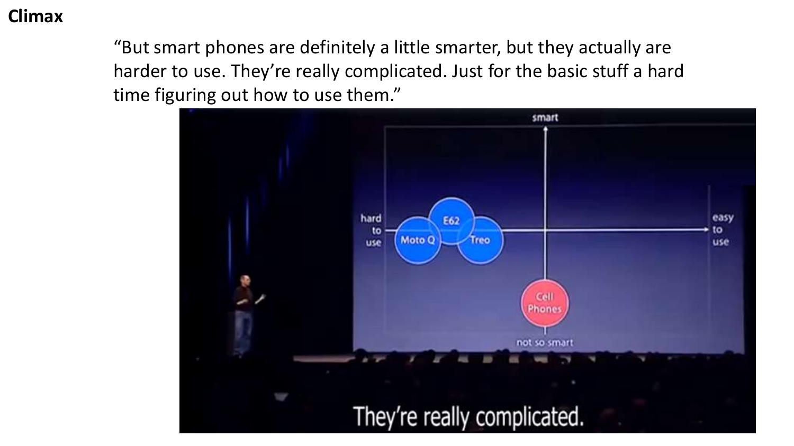
  

  

    
Real-life demo

    <h2>The Starbucks prank works because it follows serious proof</h2>
    
By the time the joke lands, maps, search, calling, and multitouch have already been demonstrated together.

    

      <h3>Why it works</h3>
      
The humor is not decoration. It proves cross-app fluidity in a way the room will remember.

    

  

---

  

    
Rhetorical texture

    <h2>Questions keep the audience mentally inside the demo</h2>
    
The companion deck identifies 79 questions. Many are small checks: “Right?”, “Isn’t that cool?”, “What should we charge?”

    

      <h3>Effect</h3>
      
The questions make a one-way keynote feel conversational, and they convert understanding into audience response.

    

  

  

    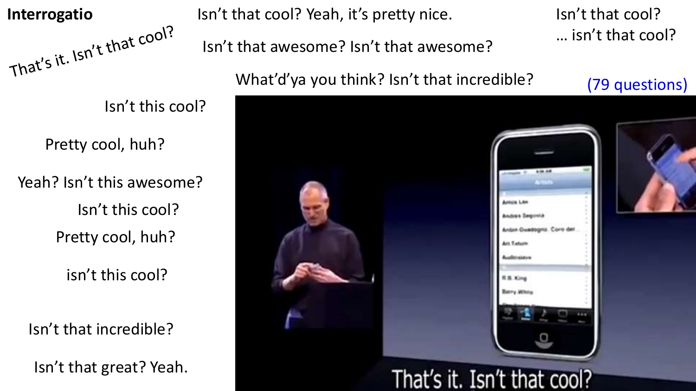
  

---

  

    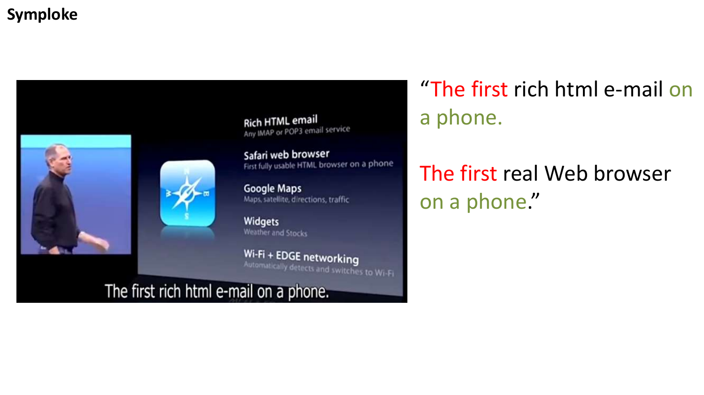
  

  

    
Repetition

    <h2>The repeated “first real...” phrasing upgrades features into category claims</h2>
    
He does not just say the phone has email, a browser, and maps. He frames them as first credible versions on a mobile device.

    

      <h3>Why it works</h3>
      
Repetition creates a drumbeat of legitimacy: each feature is not another checkbox, it is another category correction.

    

  

---

  

    
Pricing

    <h2>He anchors against pieces, then sells the bundle</h2>
    
The pricing story asks what an iPod, smartphone, communicator, and breakthrough interface would cost separately.

    

      <h3>What he is doing</h3>
      
The price is not defended from manufacturing cost. It is defended from accumulated perceived value.

    

  

  

    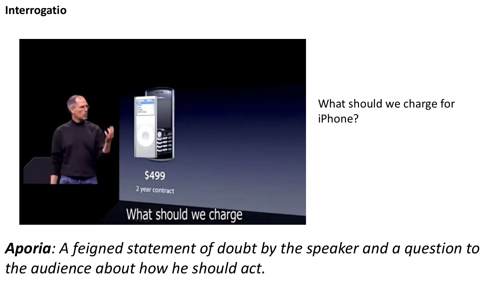
  

---

  

    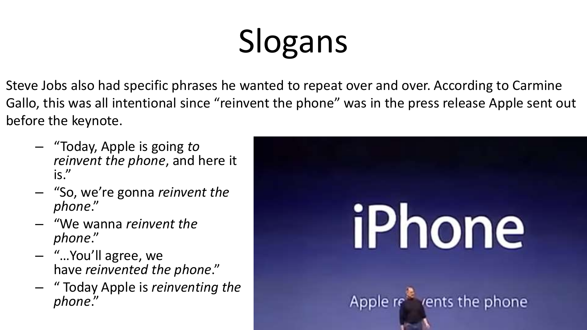
  

  

    
Close

    <h2>The ending compresses the argument into a sentence</h2>
    
After two hours of proof, “Apple reinvents the phone” is not just a slogan. It is the conclusion the audience has been led to draw.

    
The strongest launch narrative does not describe the product. It teaches the audience the old category is broken, then demonstrates the new rules.

  

---

<h1>Reusable Playbook</h1>

  

    
1

    <h3>Draw the old world</h3>
    
Name the current compromise so every competitor inherits the same flaw.

  

  

    
2

    <h3>Reveal the mechanism</h3>
    
Make the core invention feel like the simplest possible answer.

  

  

    
3

    <h3>Prove through verbs</h3>
    
Let live actions carry the feature claims and the emotional payoff.

  

  <h3>For our own presentations</h3>
  
Lead with the category tension, not the product catalog. Use visuals to show the old constraint, then demos to make the new behavior obvious.

---

<h1>Source Notes</h1>

<ul class="compact mt-8">
  <li><strong>Transcript source:</strong> `/Users/garybasin/Downloads/Steve Jobs iPhone 2007 Presentation Transcript.pdf`.</li>
  <li><strong>Visual source:</strong> `/Users/garybasin/Downloads/Steve Jobs iPhone Launch 2007.pdf`.</li>
  <li><strong>Generated assets:</strong> rendered source pages live in `/public/source-slides` for Slidev.</li>
  <li><strong>Interpretive layer:</strong> analysis focuses on framing, contrast, repetition, demo sequencing, and proof mechanics.</li>
</ul>

Use presenter mode to treat the deck as a study guide: each slide pairs a source visual with the launch move it illustrates.

